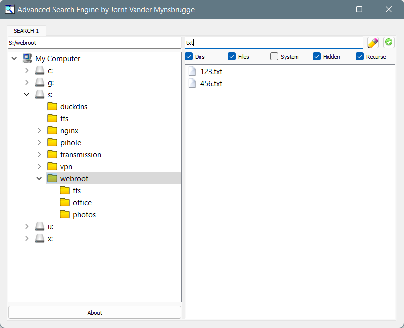

# jsearch
Tabbed file search app  
  
## why
Built to gain some experience with: 

* QShortcut
* QTabWidget
* QTreeWidget
* QDir
* QThread

## screenshots

## notes
2023
- ported to Python3 and PyQt5
- lessons learned: 
  - update all imports
  - python 3 requires relative imports to be prefixed with . in packages
  - pyqt5 handles signals connection & emission differently (but better)
  - there is no more QString as str is now unicode -> replace all QString functions too! 

2009
- first build in Python 2 and PyQt4
